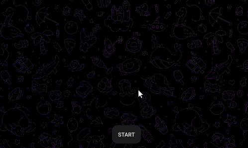

# Telegram Torrent Bot 

[](PoC.gif)

A Telegram bot  to download torrents directly using magnet links, powered by the efficient [Rain](https://github.com/cenkalti/rain) library.

## Features 

- **Direct Torrent Downloads:** Fetch and download torrents effortlessly using magnet links, right within Telegram.
- **Selective File Downloads:** Choose specific files to download, or grab everything with a simple command.
- **Real-time Progress Updates:** Stay informed with live download progress notifications.
- **Automatic File Upload:** Receive your downloaded files directly in Telegram upon completion.
- **Robust Logging System:** Comprehensive logs for easy debugging and monitoring.
- **Containerized for Simplicity:** Deploy effortlessly with Docker.

## Project Structure 

```
.
├── bot/                # Bot logic
├── config/             # Configuration handling
├── server/             # Core functionality
├── downloads/          # Downloaded files storage
├── logs/               # Log files
├── .env                # Environment variables
├── docker-compose.yml  # Docker Compose configuration
├── Dockerfile          # Docker build instructions
├── go.mod              # Go module definition
├── go.sum              # Go module checksums
├── main.go             # Application entry point
└── Makefile            # Build and run automation
```

## Requirements 

- **Go 1.22+:** Ensure you have the latest Go version installed.
- **Docker & Docker Compose:** For containerized deployment.
- **Telegram Bot Token:** Obtain yours from [@BotFather](https://t.me/BotFather).

## Quick Start 

### Local Development 

1. **Clone the Repository:**
   ```bash
   git clone [https://github.com/NisoD/torrent-bot-telegram.git](https://www.google.com/search?q=https://github.com/NisoD/torrent-bot-telegram.git)
   cd torrent-bot-telegram
   ```
2. **Setup Environment:**
   ```bash
   make setup
   ```
3. **Configure `.env`:**
   ```
   TELEGRAM_BOT_TOKEN=your_bot_token_here
   ```
4. **Run the Bot:**
   ```bash
   make run
   ```

### Docker Deployment 

1. **Setup Environment:**
   ```bash
   make setup
   ```
2. **Configure `.env`:** Add your Telegram bot token.
3. **Build and Run with Docker:**
   ```bash
   make docker-run
   ```
4. **View Logs:**
   ```bash
   make docker-logs
   ```
5. **Stop the Container:**
   ```bash
   make docker-stop
   ```

## Environment Variables ⚙️

| Variable             | Description                                  | Default          |
|----------------------|----------------------------------------------|------------------|
| `TELEGRAM_BOT_TOKEN` | Your Telegram bot token (Required)           | (Required)       |
| `DOWNLOAD_PATH`      | Path to store downloaded files               | `/app/downloads` |
| `LOG_PATH`           | Path to store log files                      | `/app/logs`       |
| `MAX_FILE_SIZE`      | Maximum file size for upload (in bytes)     | 50MB (52428800)  |

**Note:** For group usage, the `MAX_FILE_SIZE` can be increased to 2GB.

## Bot Usage

1. **Start a Chat:** Initiate a conversation with your bot on Telegram.
2. **Begin:** Send `/start` to get started.
3. **Send a Magnet Link:** Paste a magnet link to fetch torrent information.
4. **Select Files:**
   - Specify file numbers separated by commas (e.g., `1,3,5`).
   - Send `all` to download all files.
5. **Download and Receive:** The bot will download and upload the selected files directly to your chat.

## Troubleshooting 

- **Bot Not Responding:** Verify your `TELEGRAM_BOT_TOKEN` and ensure the bot is running.
- **Download Failures:** Some torrents may have limited or no seeders.
- **Upload Limits:** Telegram bots have a 50MB file size limit (extendable to 2GB in groups).

## Upcoming Features (MVP 2.0) 🚀

> The next phase of this project will include:

- **AWS S3 Integration:** Seamlessly store and manage your downloaded files in the cloud.
- **Serverless Architecture:** Exploring serverless technologies to optimize resource usage and scalability.

Stay tuned for these exciting updates!


## Disclaimer 

This tool is intended for downloading and sharing legal content only. Users are responsible for complying with all applicable copyright laws.


